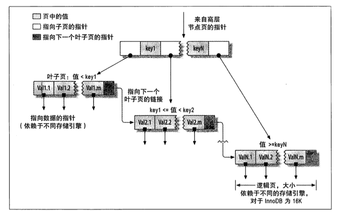
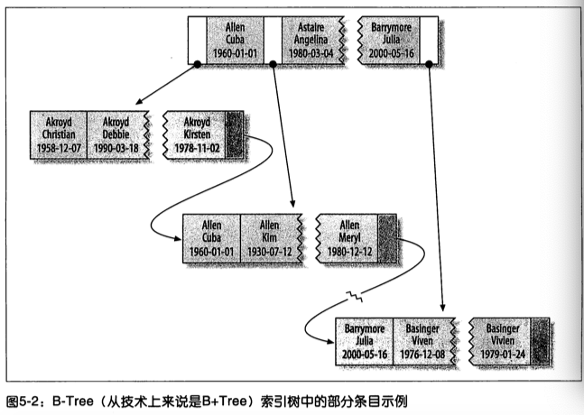

## 索引的类型:

### B-Tree 索引 
InnoDB 使用的是B+Tree   

 
根节点的槽中存放了指向子节点的指针，存储引擎根据这些指针向下查找。通过要查找的值来找到合适的指针进入下层节点。

假设有如下数据表

```sql
create table people(
    last_name varchar(50) not null,
    first_name varchar(50) not null,
    dob date not null,
    gender enum('m','f') not null,
    key(last_name,first_name,dob)
);
```

对于表中的每一行数据，索引中包含了last_name,first_name 和 dob 列的值。 显示了该索引是如何组织数据存储的。



有效使用索引：
* 全值匹配
* 匹配最左前缀
* 匹配列前缀 
* 匹配范围值 
* 精确匹配某一列并范围匹配另外一列 
* 值访问索引

B-Tree 索引的限制：

* 如果不是按照索引的最左侧开始查找，就无法使用索引。
* 不能跳过索引中的列，如果要查找姓名为 A 生日在 B 的人是只能使用索引的第一列。


### B-树   

* 内部节点:含有与页相关联的页的副本   
* 外部节点:含有指向实际数据的引用   
* 哨兵键:小于其他所有键，一开始B-树只含有   
一个根节点，节点初始化出的就是哨兵节点   

#### 查找和插入    

查找:在可能含有被查找键的唯一子树中进行一次递归的  
搜索   

插入:    
如果被插入的节点变成一个溢出的节点   
递归调用不断向上调用分裂溢出的节点   


## 为什么使用B-Tree / B+Tree 

主要和硬盘的存取原理有关。
硬盘不是按需读取的，每次读取都会预读一些。
```
当一个数据被用到的时候，其附近的数据也会通常马上使用程序运行期间所需要的数据通常比较集中
```

一般预读的长度为页的整数倍

为什么使用B-Tree/B+Tree 不用红黑树  
出度大，并且高度小（通常不会超过3）

为什么使用 B+树
* 适合外部存储，内部没有data域，一个索引节点可以存储多个节点，一个索引节点可以存储大量分支，每个节点能够索引的范围更大更精确，也意为着B+树单次IO信息量大于B- 树 I/O效率高
* B+树查询必须找到叶子节点，B树只要匹配到就可以不管元素位置，而且更加稳定（并不慢）
* B+树只要顺序遍历叶子节点，B树却需要重复的中序遍历。